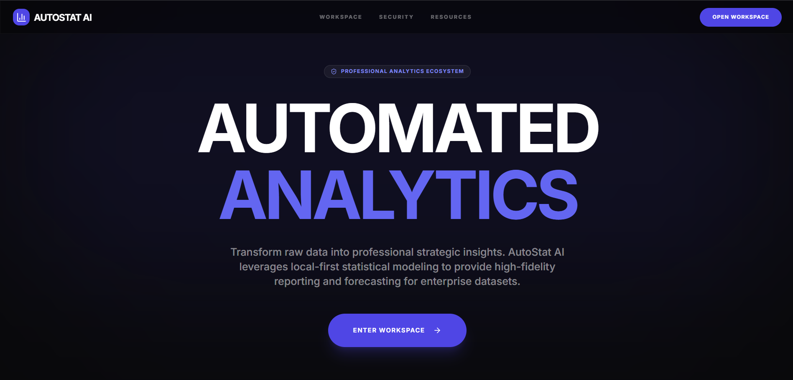
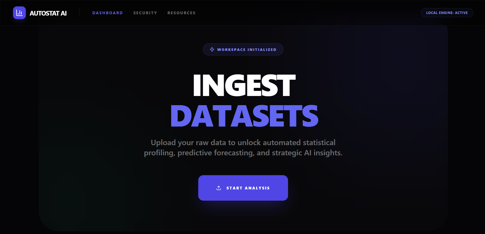

````markdown
<div align="center">

# 🚀 AutoStat AI

### AI-Powered Statistical Analytics, Forecasting & Executive Intelligence Platform

Transform raw datasets into professional analytical reports, predictive forecasts, interactive visualizations, and AI-generated executive insights.

<br>

<a href="https://autostat-ai.vercel.app">
  
</a>

<a href="https://github.com/joshuaziegenpaul17/AutoStat-AI">
  
</a>

<a href="https://www.linkedin.com/in/joshua-ziegen-paul">
  
</a>

<a href="https://autostat-ai.vercel.app">
  
</a>

<br><br>


<br>

### 🌐 Live Application

https://autostat-ai.vercel.app

### 👨‍💻 Developed By

**Joshua Ziegen Paul**

[LinkedIn](https://www.linkedin.com/in/joshua-ziegen-paul) • [GitHub](https://github.com/joshuaziegenpaul17)

</div>

---

## 📌 Overview

AutoStat AI is a modern analytics platform that transforms raw datasets into actionable business intelligence.

The platform combines:

- Statistical Analysis
- Data Visualization
- Forecasting
- Data Quality Assessment
- AI Executive Insights
- Professional Report Generation

Users can upload Excel datasets and instantly receive professional analytical outputs suitable for academic, research, and business environments.

---

## 📸 Platform Preview

### Landing Page



---

### Analytics Dashboard



---

## ✨ Core Features

### 📊 Automated Statistical Profiling

Generate:

- Mean
- Median
- Mode
- Variance
- Standard Deviation
- Range
- Skewness
- Kurtosis
- Summary Statistics

---

### 📈 Interactive Visualizations

Create dynamic charts including:

- Histograms
- Pie Charts
- Distribution Charts
- Trend Analysis
- Correlation Visualizations
- Category Comparisons

---

### 🔍 Data Quality Assessment

Automatically detect:

- Missing Values
- Outliers
- Data Inconsistencies
- Structural Issues

---

### 🤖 AI Executive Intelligence

Powered by Groq + Llama 3.3 70B

Generate:

- Executive Summaries
- Strategic Recommendations
- Opportunity Analysis
- Risk Identification
- Business Insights

---

### 📉 Predictive Forecasting

Perform:

- Trend Forecasting
- Growth Projection
- Sequential Analysis
- Historical Pattern Recognition

---

### 📄 PDF Report Export

Generate downloadable reports containing:

- Statistical Findings
- Visualizations
- Forecast Outputs
- AI Insights
- Recommendations

---

### 🔒 Security & Compliance

Includes:

- Privacy Policy
- Terms of Service
- Security Information
- Professional Disclaimer

---

## 🛠 Technology Stack

| Category | Technology |
|-----------|-----------|
| Framework | Next.js 15 |
| Language | TypeScript |
| Styling | Tailwind CSS |
| UI Components | ShadCN UI |
| Charts | Recharts |
| AI Provider | Groq |
| LLM | Llama 3.3 70B |
| Data Processing | XLSX |
| Deployment | Vercel |
| Version Control | GitHub |

---

## ⚙️ Installation

### Clone Repository

```bash
git clone https://github.com/joshuaziegenpaul17/AutoStat-AI.git
cd AutoStat-AI
````

### Install Dependencies

```bash
npm install
```

### Configure Environment

Create:

```env
.env.local
```

Add:

```env
GROQ_API_KEY=your_api_key_here
```

### Start Development Server

```bash
npm run dev
```

Open:

```text
http://localhost:9002
```

---

## 🚀 Deployment

Deployed on Vercel:

https://autostat-ai.vercel.app

---

## 🎯 Use Cases

* Business Analytics
* Market Research
* Sales Forecasting
* Academic Projects
* Statistical Reporting
* Exploratory Data Analysis
* Executive Reporting
* Predictive Analytics

---

## 🎓 Academic Relevance

Demonstrates practical implementation of:

* Descriptive Statistics
* Data Visualization
* Exploratory Data Analysis
* Forecasting Techniques
* Business Intelligence
* AI-Assisted Analytics

Suitable for:

* MSc Statistics
* Data Science
* Business Analytics
* Applied Statistics
* Data Analytics

---

## 📂 Project Structure

```bash
AutoStat-AI/
│
├── docs/
│   ├── landing-page.png
│   └── dashboard.png
│
├── src/
│   ├── app/
│   ├── components/
│   ├── hooks/
│   └── lib/
│
├── public/
├── package.json
├── tailwind.config.ts
├── next.config.ts
└── README.md
```

---

## 👨‍💻 Author

### Joshua Ziegen Paul

MSc Statistics Student

Passionate about:

* Statistics
* Data Science
* Machine Learning
* AI Applications
* Business Intelligence
* Forecasting

### Connect With Me

💼 LinkedIn
https://www.linkedin.com/in/joshua-ziegen-paul

🐙 GitHub
https://github.com/joshuaziegenpaul17

🌐 Live Project
https://autostat-ai.vercel.app

---

## ⭐ Support

If you found this project useful:

⭐ Star the repository

🍴 Fork the project

🚀 Share it with others

---

## ⚠ Disclaimer

AutoStat AI is intended for educational, analytical, and informational purposes only.

Forecasts, insights, and recommendations generated by the platform should not be considered legal, financial, medical, or investment advice.

Users are responsible for independently validating results before making strategic decisions.

---

<div align="center">

# ⭐ AutoStat AI

### Transform Raw Data Into Strategic Intelligence

Built with Next.js • TypeScript • Statistics • Forecasting • Artificial Intelligence

</div>
```
